 # CMU-15-213-Intro-to-Computer-Systems
Notes and labs for the course 15-213 Introduction to Computer Systems at CMU

# Integer representation
* Data types
    * char, short, int, long, float, double, pointer
    * Word size equals length of pointer datatype
* Bit-level operations
* Signed / unsigned conversion
* Byte ordering
    * Big Endian: Sun, PPC Mac, Internet
    * Little Endian: x86, ARM  
    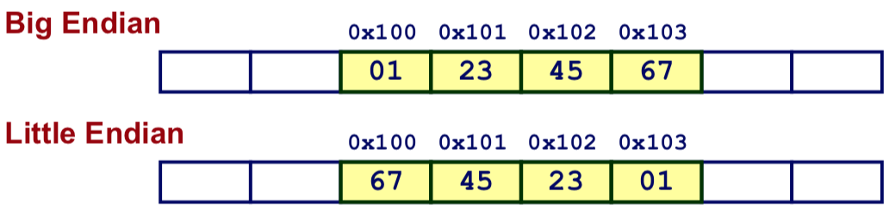


# IEEE 754
* Numeric form
    $(-1)^sM2^E$
* Encoding
    * s: sign bit
    * exp: E
    * frac: M  
    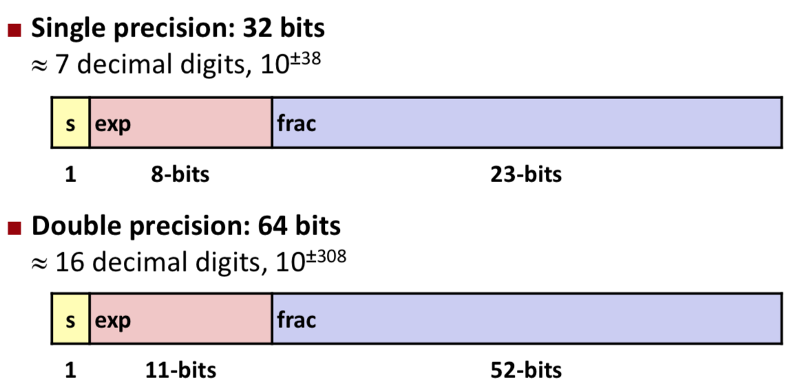
* Three kinds of values
    * Denormalized: exp = 0
    * Normalized: 0 < exp < 11..11
    * Special: exp = 11...11 (e.g. inf & NaN)  
    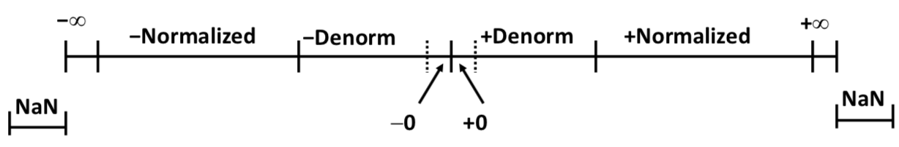
* Roundings

# x86-64
* History
    * 8086 -> 386 -> Pentium 4E -> Core 2 -> Core i7
    * IA32 -> x86-64
    * CISC architecture
    * Case study: Core-i7 6700K Skylake
        * Shared L3 cache (LLC)
        * Hyper-Threading: Shared caches, buses & ALUs
        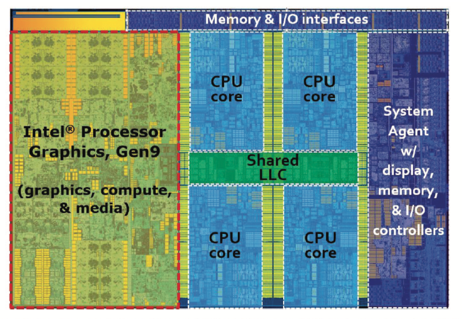
* Registers  
    * Can reference low-order 4 bytes (backwards compatibility)
    * `%rsp` is stack top, others are general-purpose  
        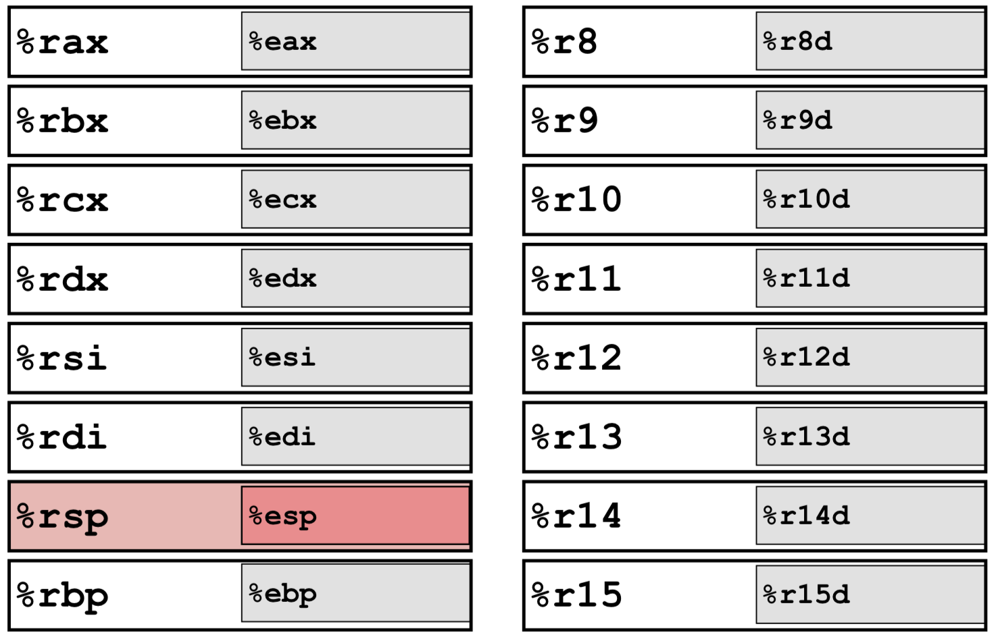  
    * `%rip` is instruction pointer (not listed)  
    * A register for implicitly-set condition codes

# Machine-level Programming
* Addressing modes
    * Normal: `(R)` -> `Mem[Reg[R]]`
    * Displacement: `D(R)` -> `Mem[Reg[R] + D]`
    * Complete: `D(Rb,Ri,S)` -> `Mem[Reg[Rb] + S*Reg[Ri] + D]`
        * `(Rb,Ri)` -> `Mem[Reg[Rb] + Reg[Ri]]`
        * `D(Rb,Ri)` -> `Mem[Reg[Rb] + Reg[Ri] + D]`
        * `(Rb,Ri,S)` -> `Mem[Reg[Rb] + S*Reg[Ri]]`
* Some instructions
    * `movq Src, Dst`
        * Cannot do memory-memory transfer with a single instruction
        * Intel docs use `mov Dst, Src`
    * `leaq Src, Dst`
        * Src is address mode expression, set Dst to address denoted by expression
        * Similar to `p = &x[i]`
        * Used for arithmetics for form like `x + k * y`
        * Does not change condition codes
    * `addq/subq Src, Dst`
    * `imulq Src, Dst`
    * `salq/sarq/shrq Src, Dst`
    * `xorq/andq/orq Src, Dst`
    * `pushq src`
    * `popq dest`
    * `incr dest`
* Compiler, Assembler, Linker & Loader  
    1. Compiler
        * Translates C files (.c) into assembly files (.s)
    2. Assembler
        * Translates assembly files (.s) into object files (.o)
        * Missing linkage between compilation units
    3. Linker
        * Resolve references between object files
        * Combine with static libraries (malloc, printf, etc)
    4. Dynamic linked libraries
        * Linking occurs at runtime
        * Does not take too much disk space  
    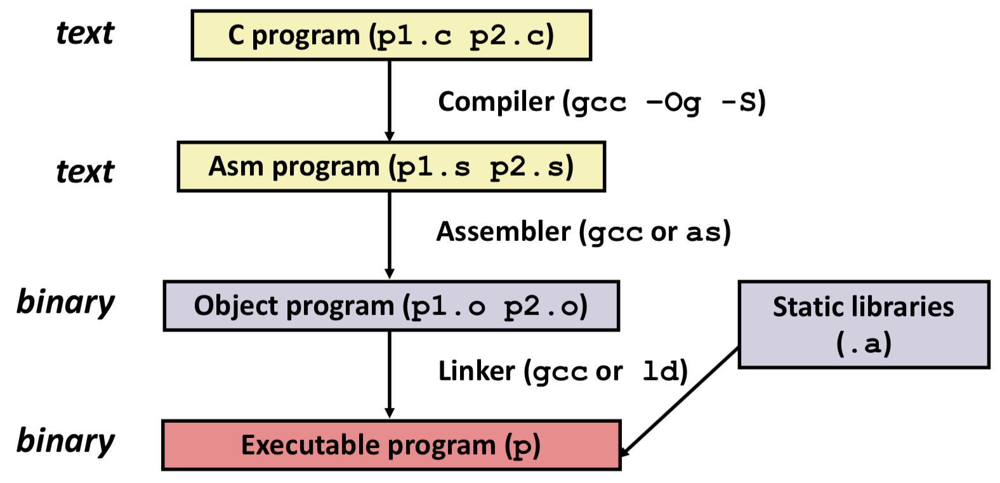  
* Controls
    * Jumping
        * `jmp`, `je`, `jne`, `js` ...
        * However, branches are very disruptive to instruction flow through pipelines
    * Conditional moves: `cmovle`
        * Do not require control transfer
        * Use `-fno-if-conversion` flag to supress implicit conversion
    * Switch statements
        * Jump table structure  
            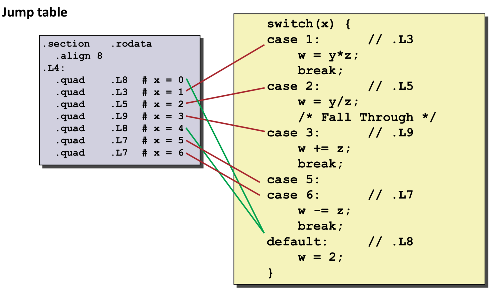  
        * Make use of "fall through"
* Procedures
    * Passing control
        * Procedure call: `call label`
            * Push return address into stack
            * Jump to label
        * Procedure return: `ret`
            * Pop return address from stack
            * Jump to this address
        * Return address: Address of next instruction after the call statement
    * Passing data
        * First 6 arguments: `%rdi`, `%rsi`, `%rdx`, `%rcx`, `%r8`, `%r9`
        * Other arguments passed using stack
        * Return value: `%rax`
        * IA-32 pass all arguments in stack
        * Concept of stack frames:
            * Marked by `%rbp` (optional) and `%rsp`
            * No additional mechanism for recursion is needed  
            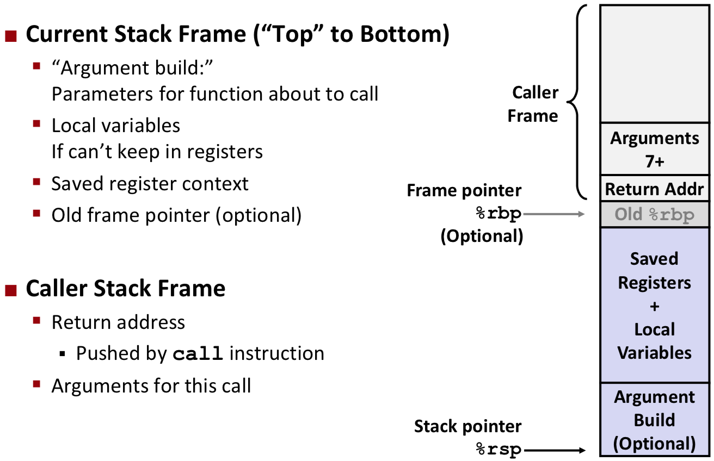
        * Register saving conditions
            * Caller saved
                * `%rdi`, `%rsi`, `%rdx`, `%rcx`, `%r8`, `%r9`, `%rax`, `%r10`, `%r11`
            * Callee saved
                * `%rbx`, `%r12`, `%r13`, `%r14`, `%rbp`
                * `%rsp` is also a special form of callee-saved
    * Memory management
    * ABI: Application Binary Interface
* Data
    1. Arrays  
        * 1D arrays  
            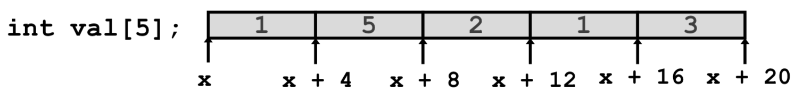  
        * Nested 2D arrays: `int A[R][C]`
            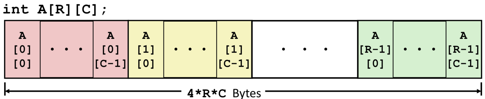  
        * Multi-level 2D arrays:  
            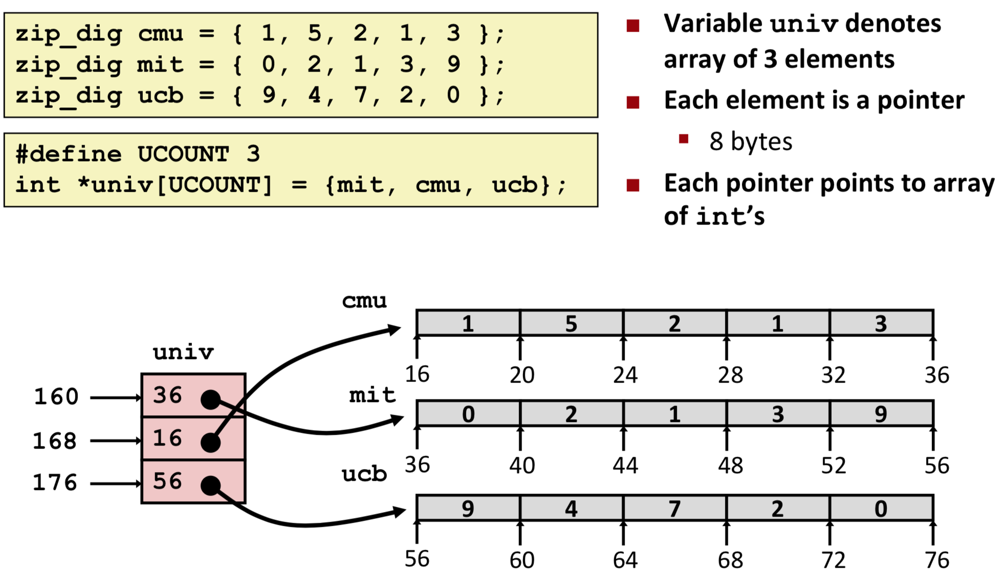  
    2. Structs
        * Represented as block of memory
            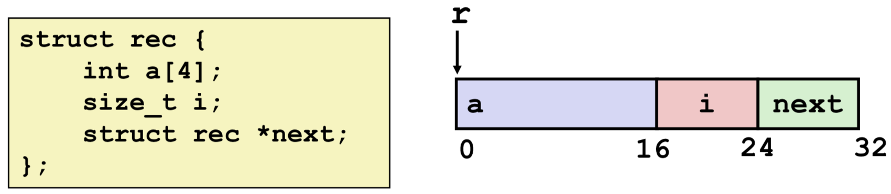  
        * Fields are ordered according to declaration
        * Alignment:  
            * Within struct: Each element has alignment requirement K, where K is the size of this element
                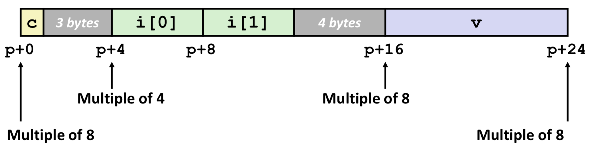  
            * Overall: Each struct has alignment requirement K, where K is the largest alignment of any element in struct
                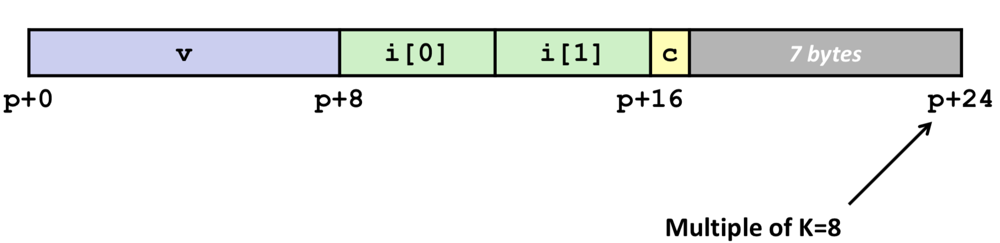  
            * To save space, put large data types first
    3. Float operations
        * Arguments passed in `%xmm0`, `%xmm1`, ...
        * Result returned in `%xmm0`
        * Different mov instructions are used to move floats
* Address space
    * Currently using 47-bit addresses (highest address of 0x7fffffffffff)
    * Maximum stack size of 8MB on most machines  
        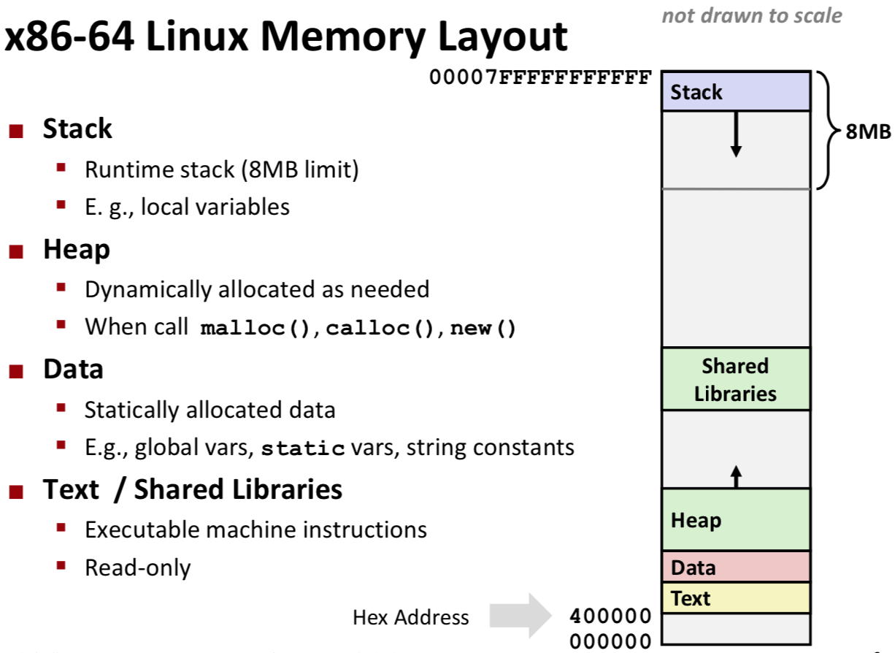  
* Vulnerablities
    1. Buffer overflow
        * Triggered by functions manipulating strings of arbitrary length
        * `gets`, `strcpy`, `strcat`, `scanf`, `fscanf`, `sscanf`
    2. Return-oriented programming (ROT)
        * Make use of "gadgets" in text segment  
        * Trigger with `ret` instruction  
            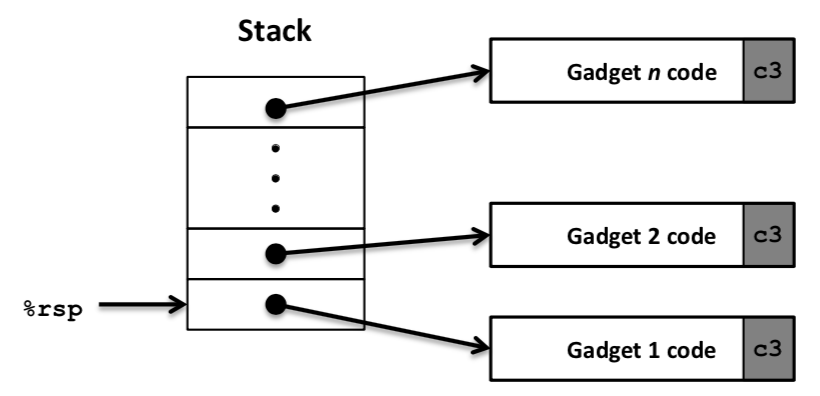  
* Protection
    1. Use routines limiting string lengths (user-level)
    2. Randomized stack offsets
    3. Nonexecutable code segments
    4. Stack canaries

# Code optimization
* Optimization by programmer
    1. Code motion: Reduce frequency of computations performed   
        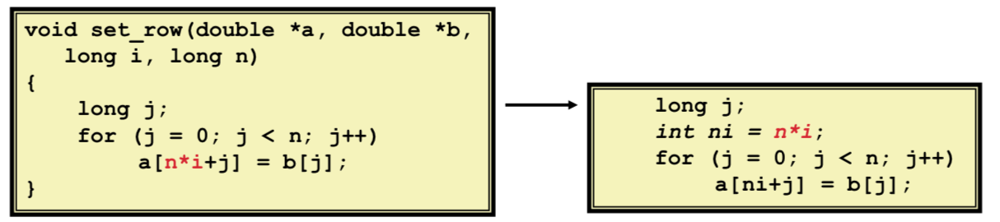   
        GCC will do this with -O1  
    2. Reduction in strength: Reduce costly operation with simpler one  
        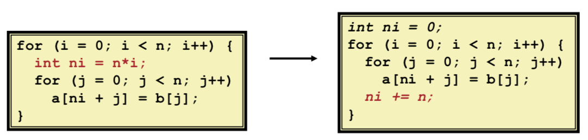  
        Here, int mul requires 3 clock cycles, int add requires 1 clock cycle 
    3. Share common subexpressions  
          
* Optimization blockers
    1. Procedures: Seen as a "black box"
        * Procedures may have side effects
        * May not return same result with same argument
        * Fix: Use inline functions (GCC with -O1 within single file)
    2. Memory aliasing: Two memory references specify single location
        * The following code does memory load and store every time, because compiler assume possibility of memory aliasing:  
            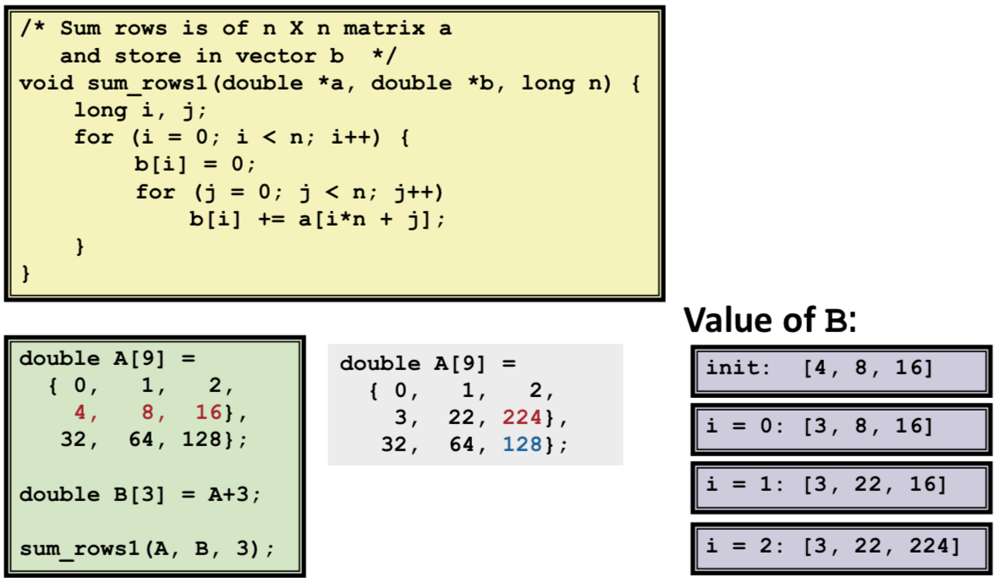  
        * Load and store take multiple clock cycles
        * Easily caused by direct access to storage structures
        * Fix: Define local variable to tell compiler not to check for aliasing
            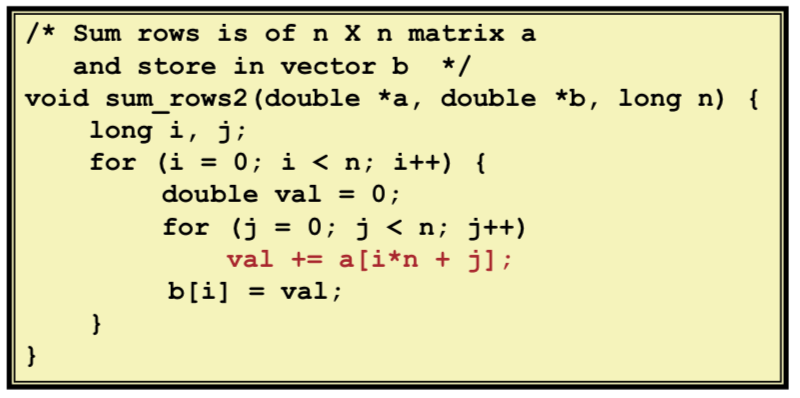  
        * Get in habit of introducing local variables accumulating within loops
* Optimization (by programmer) limitations
    1. Most performed within procedures. Newer versions of GCC do interprocedual optimization, but not between codes in different files
    2. Based on static information
    3. Conservative: Must not change program behavior
* Instruction-level parallelism
    * Superscalar processor: Issue and execute multuple instructions per cycle, and instructions are scheduled dynamically
    * Some instruction have >1 clock cycle latency, but can be pipelined:  
        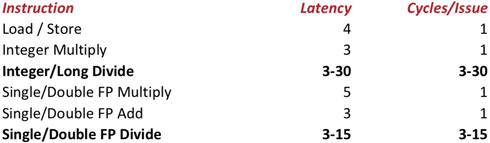  
    * Unrolling
        * Break sequential dependency to break through latency bound (to approach throughput bound)  
            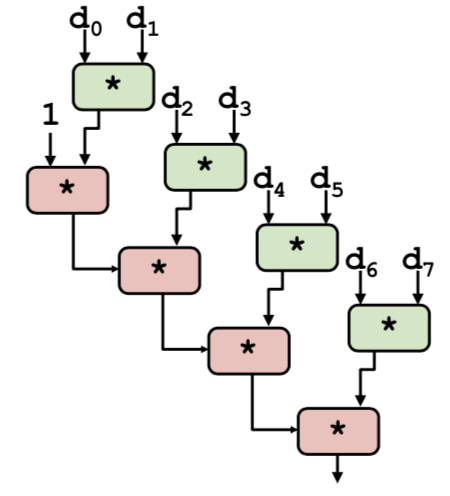  
            ```
            for(int i = 0; i < limit; ++i)
                x = x + d[i];
            ```
            can be optimized to:
            ```
            for(int i = 0; i < limit; i += 2)
                x = (x + d[i]) + d[i + 1];
            ```
            but to break sequential dependency:
            ```
            for(int i = 0; i < limit; i += 2)
                x = x + (d[i] + d[i + 1]);
            ``` 
        * adding separate accumulators
    * Branch prediction
        * Backward branches are often loops, predict taken
        * Forward branches are often if, predict not taken
        * Average better than 95% accuracy

# Memory
* Storage technologies
    1. RAMs
        * Volatile: SRAM & DRAM (caches & main memories)
        * Nonvolatile: ROM, PROM, EPROM, EEPROM (firmware, ssd & disk caches)
    2. Rotating disks
    3. SSDs
        * Page can be written only after its block has been erased
* Locality
    * Temporal locality
    * Spatial locality
* Hierarchy  
    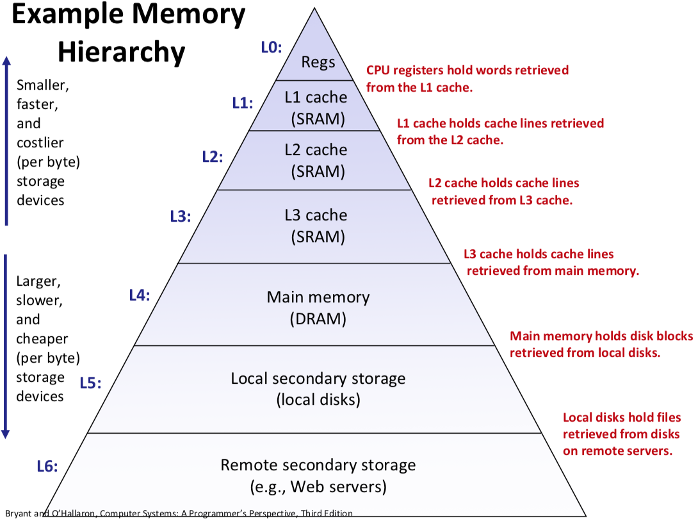  
* Caches
    * Each level in hierarchy serves as cache for the level below
    * Types of cache misses
        1. Cold miss: "Warm up" cache
        2. Capacity miss: Working set larger than cache size
        3. Conflict miss: Limited by positioning restrictions imposed by hardware
    * Examples of cache  
        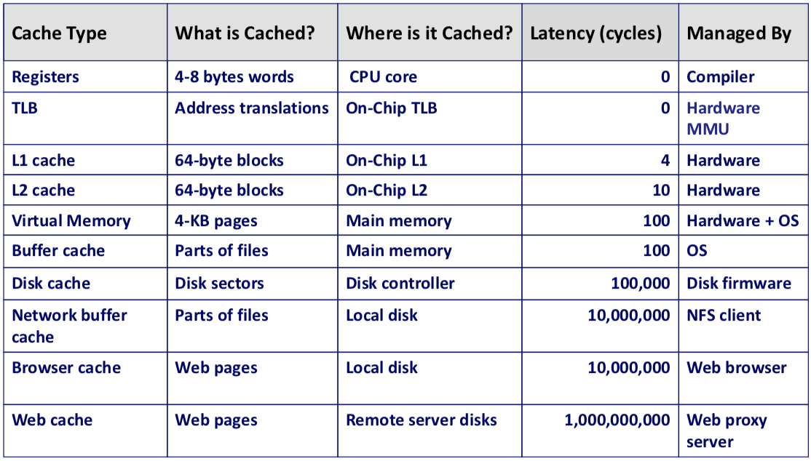  
* Cache memories
    * Concept of locality  
        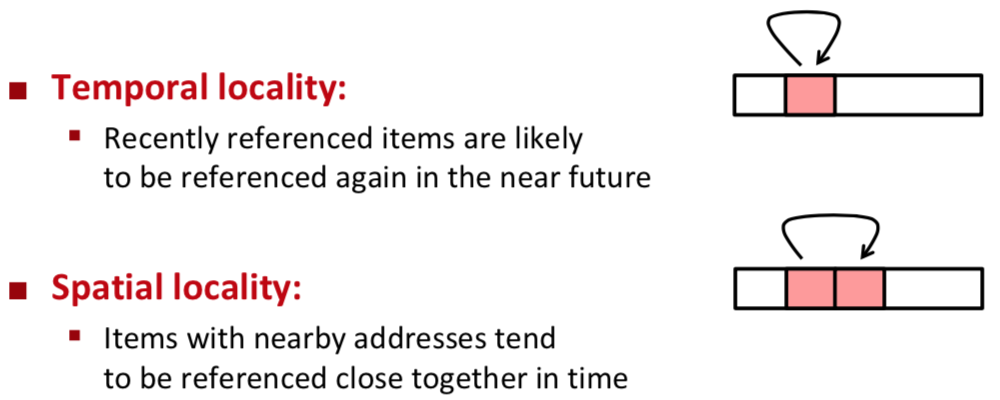  
    * General organization  
        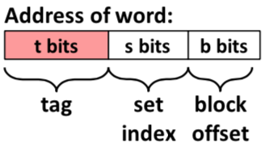
        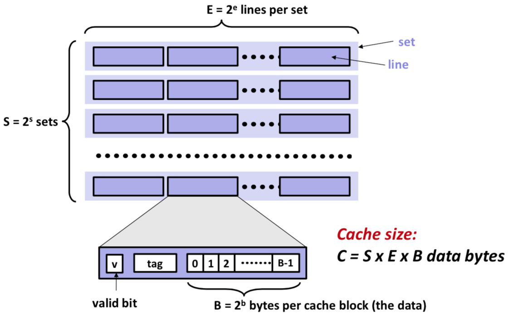  
        1. Direct mapped cache has (E / associativity = 1)  
            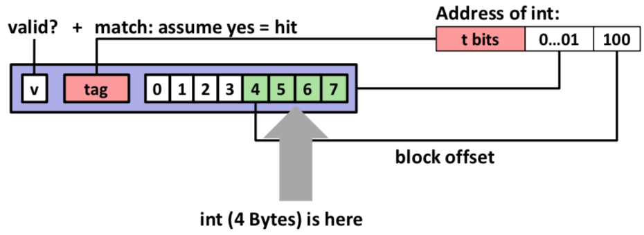  
        2. E-way set associative cache (Here E / associativity = 2)  
            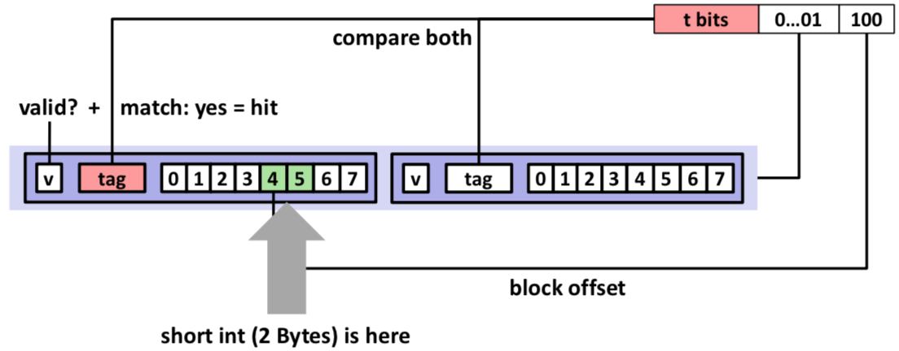   
    * Metrics
        1. Miss rate
        2. Hit time
        3. Miss penalty
    * Write cache-friendly code
        1. Make the common cases go first
        2. Minimize the misses in inner loops
        3. Try to maximize spatial locality by reading objects sequentially with stride 1
        4. Try to maximize temporal locality by using an object as often as possible once it's read from memory
    * Example of matrix multiplication
        * In which order to arrange the loops? Do miss rate analysis!
        * It turns out: kij/ikj > ijk/jik > jki/kji
        * Use blocking: multiplying by sub-matrices

# Linking
* Why linkers?
    1. Modularity
    2. Efficiency (separate complilation)
* Two kind of linking
    1. Static linking
    2. Dynamic linking
* What does linker do?
    1. Symbol resolution
        * Functions, `global` vars, `static` vars
        * Definitions are stored in __symbol table__, an array of entries (name, size, location)
        * Three kind of symbols:
            1. Global symbols: non-static functions and non-static vars
            2. External symbols: defined in other modules
            3. Local symbols: static functions and static vars
            * Note: Do not confuse local symbols with local variables. Local variables are allocated in stack at runtime, and have nothing to do with linker. 
        * Symbol resolution
            * Symbols are strong or weak:
                1. Strong: functions and initialized globals
                2. Weak: uninitialized globals
            * Multiple strong symbols are not allowed
            * Choose the strong symbol over weak symbols
            * If there are multiple weak symbols, choose arbitrary one 
                * May cause undefined behavior over different compilers
                * Fix: use `static` and explicit `extern` 
    2. Relocation
        * Merge text and data segment
        * Relative location -> absolute location
        * Updates symbol table
            * Relocation entries are used to aid symbol resolving:  
            `a: R_X86_64_32 array`
* Three kinds of object files
    1. Relocatable object file (.o file)
    2. Executable object file (a.out file)
    3. Shared object file (.so file or .dll file)
* ELF format (Executable and Linkable Format)  
    * All 3 object files use ELF format  
    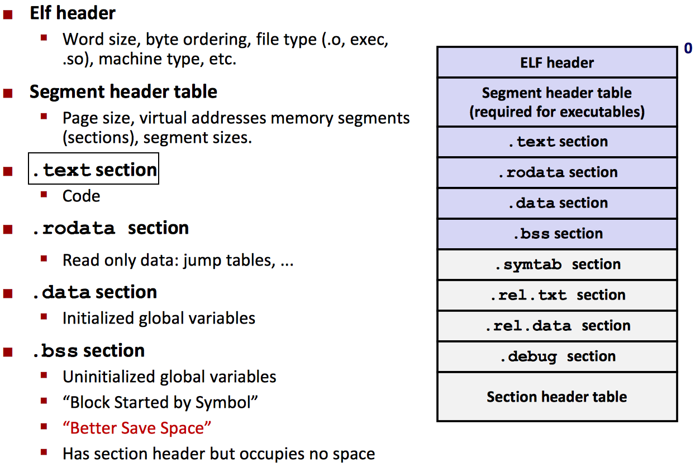
    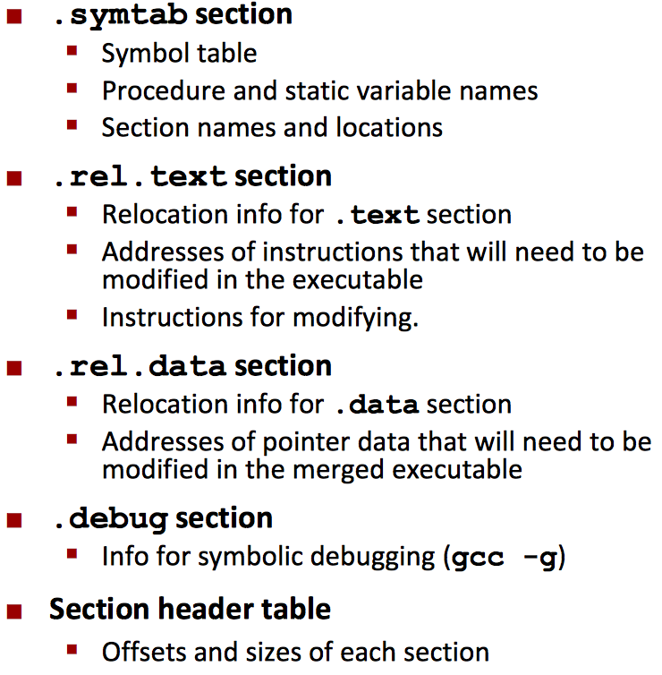  
* Static libraries (.a archive files)
    * Concatenate related relocatable object files into a single file with an index (called an archive)
    * During linking, only referenced .o files are linked
    * Command line order matters!
        * During scan, keep a list of currently unresolved references
        * If any entries in the unresolved list at end of scan, then error
        * Fix: put libraries at the end of command line
    * Commonly used libraries:
        * `libc.a` (the C standard library)
        * `limb.a` (the C math library)
    * Disadvantages
        * Duplication in storage
        * Bug fixes require relink
        * Fix: shared libraries
* Shared libraries
    * Dynamic linking can happen at:
        1. Load time
            * Handled by the dynamic linker
            * `libc.so` usually dynamically linked
        2. Run time
            * `dlopen()` interface in linux
* Library interpositioning
    * Can happen at:
        1. Compile time
        2. Link time
        3. Load/run time
    * Can be used for:
        1. Detecting memory leaks
        2. Generating address traces
    
# Exception Control Flows (ECF)
* ECFs exists in all levels:
    1. Exceptions (low level)
        * Processor responses to external events
        * Exception tables
    2. Context switch
    3. Signals
    4. Nonlocal jumps
* Exceptions (equivalent to user-kernel transition)  
    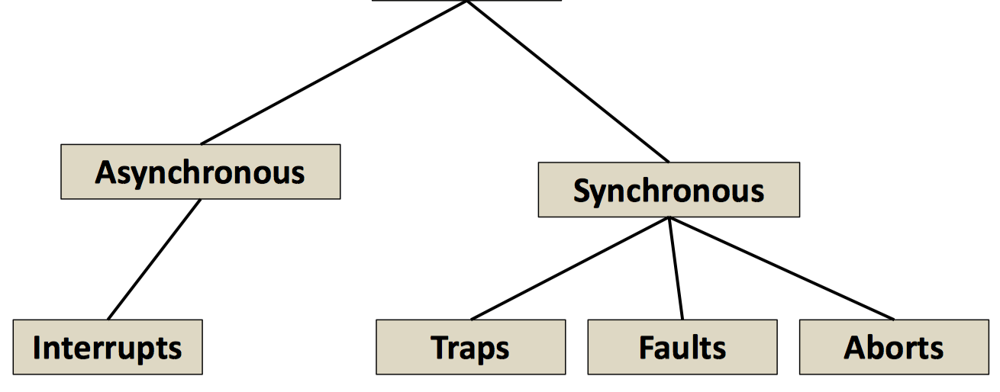  
    1. Asynchronous (Interrupts)
        * Indicated by INT pin
        * Control flow returns to next instruction
    2. Synchronous
        1. Traps
            * Intentional (syscall, breakpoints)
            * Control flow returns to next instruction
        2. Faults
            * Unintentional but possibly recoverable
            * Control flow returns to current instruction or aborts
        3. Aborts
            * Unintentional and unrecoverable
* Context switches

# Processes
* From a programmer's perspective, a process can be:
    1. Running: Executing or will be scheduled
    2. Stopped: Suspended and will not be scheduled until further notice
    3. Terminated: Stopped permanently (zombie)
        * Process terminates when: 
            1. `SIGTERM` received
            2. Return from `main()`
            3. Called `exit()`
* Creating process: `fork()`
    * `fork()` called once but returns twice
    * `exit()` and `execve()` called once but possibly never returns
    * Control flow can be modelled with process graphs via toposort:  
        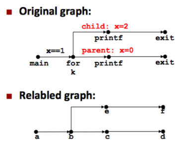
        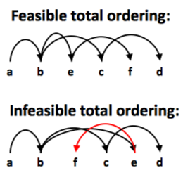
* Reaping child processes: `wait()`
    * Terminated processes become zombies, because its parent may use its exit status or OS tables
    * `wait()` and `waitpid()` reap zombie child processes
    * If parent don't reap:
        1. If parent doesn't terminate: Never diminishes (a kind of memory leak)
        2. If parent does terminate: Reaped by `init` process (pid == 1)
        * So only need to explicitly reap long-running processes
* Loading and running processes: `execve()`
    * `int execve(char *filename, char *argv[], char *envp[])`
    * Loads and runs in the current process
    * Overwrites code, data and stack
    * Retains PID, open files (e.g. `stdout`), and signal context
    * Called once and never return (except error)
* Process groups
    * Can be get and set by `getpgrp()` and `setpgid()`
    * Kill all process in a group with `kill -n -<pid>` 

# Signals
* Unix shell: An application that runs program on behalf of the user
    * Shell contains a basic loop and a `eval()` function
    * Two cases in `eval()`:
        1. Shell built-in command
        2. Not build-in, use `fork()` and `execve()`
    * __Motivation__: How to reap __both__ foreground and background jobs?
        * Basic loop: Only reaps foreground jobs
        * Fix: Signals
* Signals
    * Akin to exceptions and interrupts
    * Sent from signal (sometimes at the request of another process via `kill`)
    * Identified by an integer
    * Controlled by __per-process__ `pending` and `blocked` bit vectors
        * `pending` vector set and cleared __by kernel__ when signals is sent or received
        * `blocked` vector can be manipulated by `sigprocmask()` function
        * So, signals cannot be queued
    * __Send__: `pending` bit set
    * __Receive__: process reacts to the signal, clears `pending` bit
        1. Ignore
        2. Terminate
        3. Catch (using user-level function called _signal handler_)
    * Kernels checks for `pnb = pending & ~blocked` at beginning of a time-slice
        * If `pnb == 0`:
            * Pass control to next instruction in the process logical flow 
        * Else
            1. Choose lease non-zero bit in `pnb` and forces the process to receive the signal
            2. The receipt of the signal triggers some action by the process (clears `pending` bit)
            3. Repeat for all remaining nonzero bits
            4. Pass control to next instruction in the process logical flow
    * Default action can be one of:
        1. Termination
        2. Stop until restarted by `SIGCONT`
        3. Ignore
    * Override default action by installing `signal handlers`:
        * `handler_t *signal(int signum, handler_t *handler)`
        * `handler` can be one of:
            1. `SIG_IGN`: Ignore
            2. `SIG_DFL`: Revert to default
            3. Function pointer to a user-level signal handler
    * Signal handlers are a form of concurrency  
        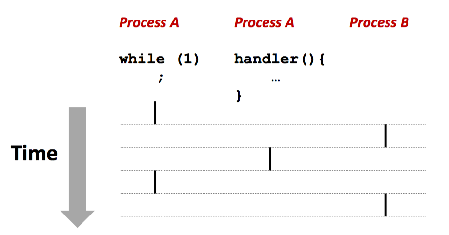
        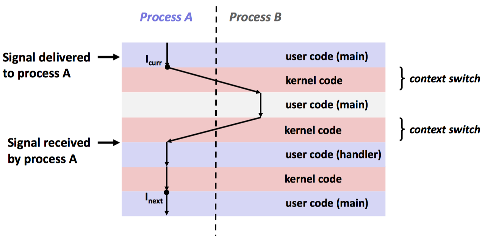  
    * Signal handlers can be nested  
        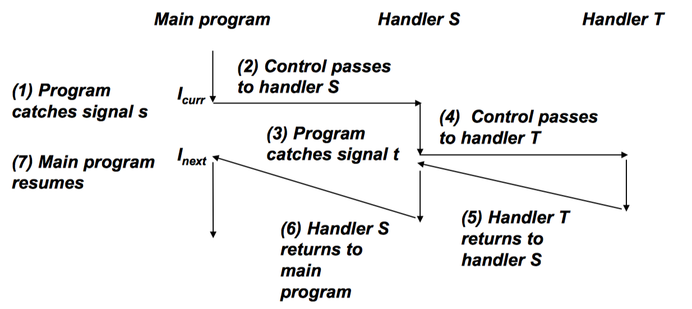  
        * So we need __blocking__
            1. Implicit blocking: blocks pendings signals of same type
            2. Explicit blocking: `sigprogmask()` with supporting functions of:
                * `sigemptyset()`
                * `sigfillset()`
                * `sigaddset()`
                * `sigdelset()`
    * How to write safe handlers?
        1. Keep handlers as simple as possible
        2. Call only `async-signal-safe` function in handlers
            * `async-signal-safe` functions are _reentrent_ (access only local variables on stack), or cannot be interrupted by another signal handler
            * `printf()`, `malloc()` and `exit()` are __not__ safe
            * `write()` is the only signal-safe output function
        3. Save and restore `errno` on entry and exit
        4. Protect accesses to shared data structures by temporarily blocking __all__ signals in __both__ handler and `main()`
        5. Declare global variables to be `volatile`, to prevent from being optimized into registers
        6. Declare global __flags__ as `volatile sig_atomic_t`
            * Flag: variable only read or written (not `flag++` or `flag+=10`)
            * `volatile sig_atomic_t` are ints on most systems
    * Avoid race conditions
        * Cannot make `any` assumption regarding execution order
        * However, we can control when handlers run by blocking
    * Explicitly waiting for signals: suppose handler sets global variable `pid`:
        * Spin wait: `while(!pid) {}`
            * Wasteful
        * Pause: `while(!pid) pause()`
            * Race condition
        * Sleep: `while(!pid) sleep(1)`
            * Too slow
        * Solution: `sigsuspend`
            * `int sigsuspend(const sigset_t *mask)`
            * Equivalent to __atomic__:
                ```
                sigprocmask(SIG_BLOCK, &mask, &prev);
                pause()
                sigprocmask(SIG_BLOCK, &prev, NULL);    
                ```
    * Portable signal handling
        * Problem: Different versions of unix have different signal handling semantics
        * Solution: Use `sigaction`

# Virtual Memory
* Physical Addressing: Used in microcontrollers, embedded systems, etc.
* __Mentality__: Main memory is a fully-associative cache for disk
    * Load doesn't necessarily happen with `execve()`. It only allocates virtual address space with valid bit of 0
    * __Loading is a result of a page fault__ (demand paging)
* Kernel memory invisible to application program. Kernel's address space starts with 1.
* Every memory access go through cache memory:
    * Both memory and cache gets updated after page fault  
        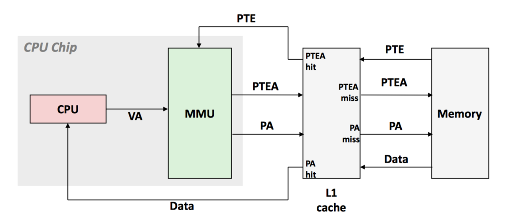  
* Address translation: Multi-level page tables
* TLB: Small __set-associative__ hardware cache in MMU
* Works only because of locality

# System-Level I/O
* Unix I/O
    1. Opening and closing files: `open()`, `close()`
    2. Reading and writing files: `read()`, `write()`
    3. Changing file position: `lseek()`
    4. View file metadata: `stat()`
        * `stat()` are both a syscall and a linux program
        * Syscalls are in second section of man: `man 2 stat` 
    * Always check return codes for these syscalls
* File types: Regular, directory, socket, named pipes, symlinks, character and block devices
* Short counts: (`nbytes < sizeof(buf)`) are possible
* Wrapper: RIO (robust I/O) package
    1. Unbuffered I/O of binary data: `rio_readn()` and `rio_writen()`
    2. Buffered I/O of text or binary: `rio_readlineb()` and `rio_readnb()`
    * RIO package is better for input and output on network sockets
* Standard I/O
    1. Opening and closing: `fopen()` and `fclose()`
    2. Reading and writing bytes: `fread()` and `fwrite()`
    3. Reading and writing text lines: `fgets()` and `fputs()`
    4. Formatted reading and writing: `fscanf()` and `fprintf()`
    * C program begin with 3 open files:
        1. `stdin` (descriptor 0) 
        2. `stdout` (descriptor 1)
        3. `stderr` (descriptor 2)
* Trace syscalls with the Linux `strace` program
* Choosing I/O functions
    * General: Use highest-level functions
    * When to use Unix I/O: Signal handlers because unix I/O functions are `async-signal-safe`
    * When to use standard I/O: Disks, terminals
    * When to use RIO: Network sockets
* How kernel represents open files  
    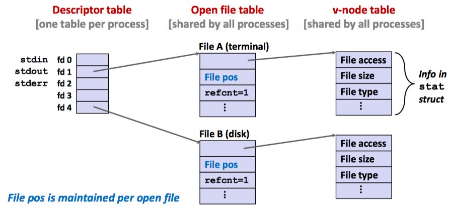
    * Open file table: An instance of opening file
        * If a process opens a file twice, there are two open file tables pointing to the same v-node table
    * V-node table: File metadata (regardless of whether file is open)
    * After `fork()`, `refcnt` is incremented:  
        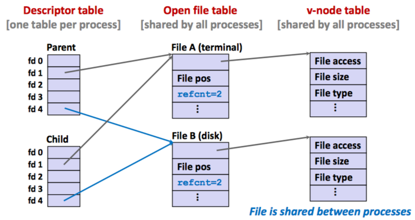  
        * Two processes share a same instance of opened file (including file position)
    * `dup2(int oldfd, int newfd)`: Used for I/O redirection
        * After calling `dup2(4, 1)`:  
            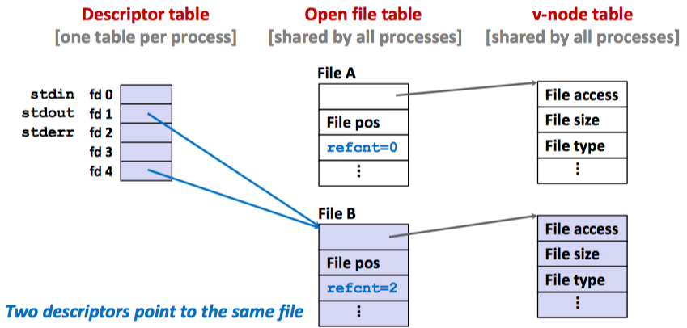  
* Recommended references:
    * W. Richard Stevens & Stephen A. Rago, _Advanced Programming in the Unix Environment_, 2 nd Edition, Addison Wesley, 2005

# Virtual Memory: Systems
* End-to-end Core i7 Address Translation  
    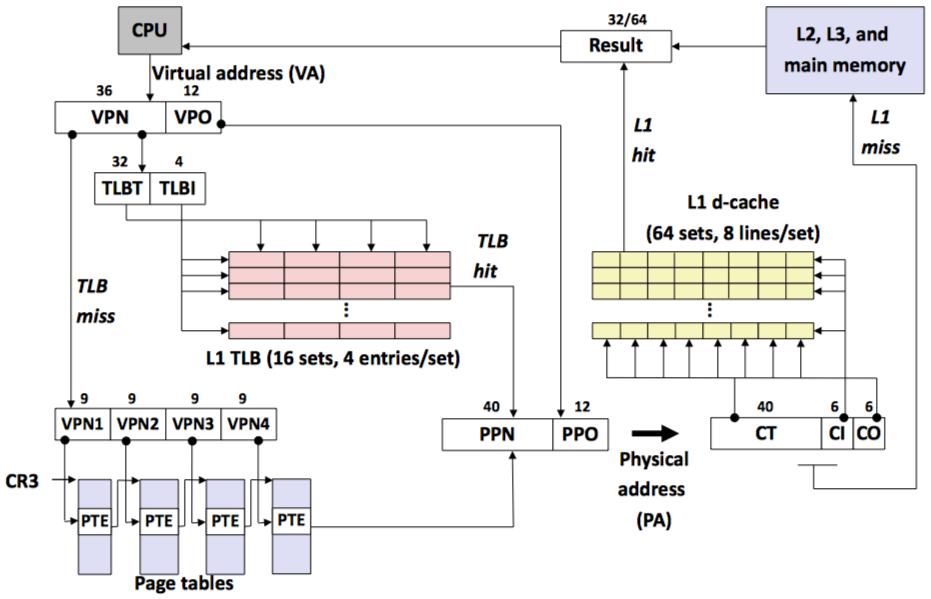  
* L1 d-cache `index` and `offset` have 12 bits is NOT a coincidence: Speed up address translation  
    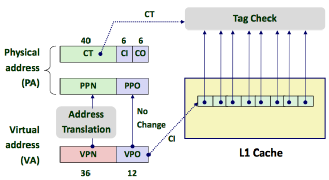  
* Linux organizes VM as collections of areas:  
    * Fault handling: Traverse the `vm_area_struct`s to check if page is allocated
    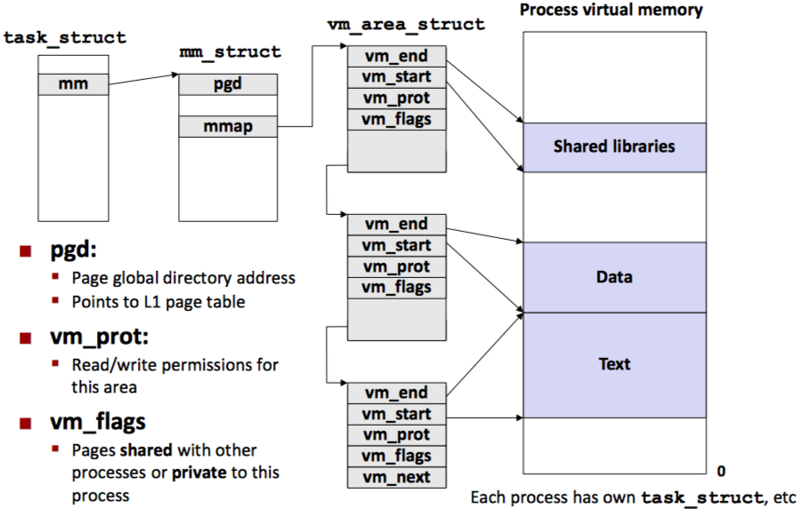  
* Private Copy-on-write (COW)
* Memory Mapping: `void *mmap(void *start, int len, int prot, int flags, int fd, int offset)`
    * `start`: A hint address
    * `prot`: `PROT_READ`, `PROT_WRITE`, `PROT_EXEC` 
    * `flags`: `MAP_ANON`, `MAP_PRIVATE`, `MAP_SHARED`
    * Returns a pointer to the start of mapped area (may not be start)

# Dynamic Memory Allocation
* Allocators: Maintain the heap as a collection of variable sized blocks, which are either _allocated_ or _free_
    * Explicit allocator: Application allocates and frees
    * Implicit allocator: Application allocates but not frees
* The `malloc` package
    * `void *malloc(size_t size)`
    * `void free(void *p)`
    * `calloc`: Initializes allocated blocks to 0
    * `realloc`: Changes size of previously allocated block
    * `sbrk`: Used internally by allocators to grow and shrink the heap
* Constraints:
    * Applications have few constraints
    * Allocators have many constraints:
        1. Can't assume allocation patterns
        2. Must respond immediately to `malloc` (can't defer allocation)
        3. Can't relocate allocated memory
* Performance goal (2 conflicting goals)
    * Throughput: Number of completed requests per unit time
    * Peak memory utilization: How to efficiently use memory
* Fragmentation
    * Internal fragmentation: 
        * Payload smaller than block size
        * Easy to measure
    * External fragmentation: 
        * Enough aggregate heap memory, but no single free block large enough
        * Difficult to measure
* Keeping track of free blocks  
    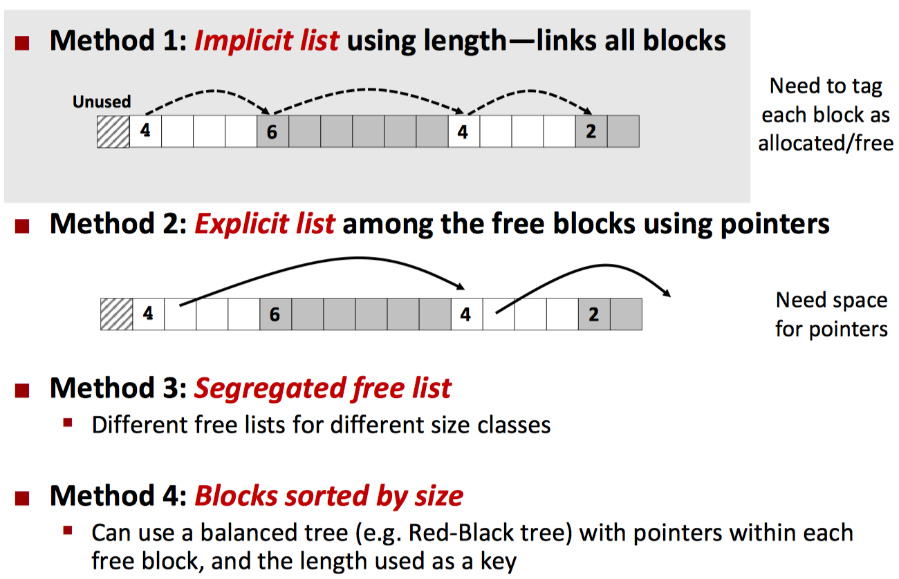  
* How to find a free block
    1. First fit
    2. Next fit
    3. Best fit
* Know how much to free: Header
    * Encodes block size (including the header and any padding) 
    * Alignment means lower-bits of size are 0, used to encode allocated bit  
        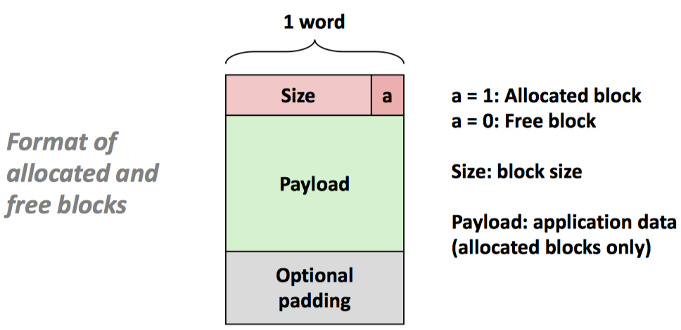  
* Implicit list
    * Allocating a free block: May need to split the block
    * Freeing a block: Have to coalesce free blocks (4 cases):  
          
    * Singly-linked list cannot free previous block in constant time
        * Fix: Doubly-linked list (head and footer)
        * Optimization: 
            * Allocated blocks doesn't need coalescing
            * We have extra bits to encode whether previous block is allocated  
            * So, allocated blocks doesn't need footer
    * Implicit lists are not commonly used because of linear time. However, the concepts of splitting and coalescing are general to __all__ allcators
* Explicit free list  
    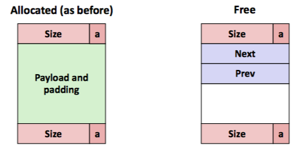  
    * Maintain list of free blocks using payload area
    * Blocks can be in any order (depending on insertion policy)
        * Unordered: LIFO, FIFO
        * Address-ordered
    * Much faster than implicit lists when memory is full
* Segregated list  
    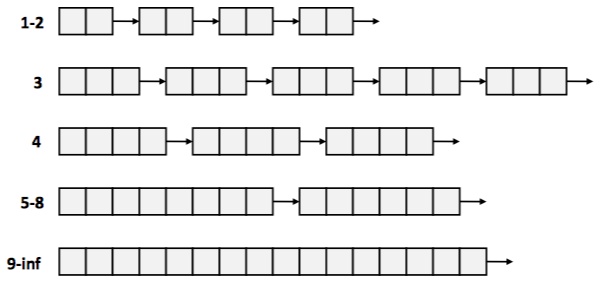  
* Garbage collection  
      
    * Mark and sweep collecting
        * Allocate using `malloc` until run out of space
        * Use extra mark bit for each block
        * Root nodes: Pointers in stack/data section
        * Does not distinguish between pointers/non-pointers, thus "safe"
        * _Mark_: Start at root nodes and do DFS
        * _Sweep_: Start at beginning of VM, and free unmarked blocks
        * How to find beginning of block? -- Use a balanced tree

# Network Programming
* Client-Server Architecture
* Network Architecture
    * Routers set borders of LANs
    * Conceptual view of LANs:  
        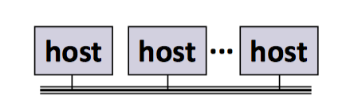  
* Socket
    * To the kernel: An endpoint of communication
    * To application: A file descriptor to write/read
    * Generic socket address:  
        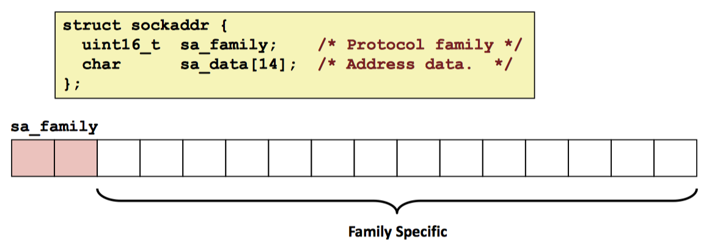  
    * IPv4 specific socket address:  
        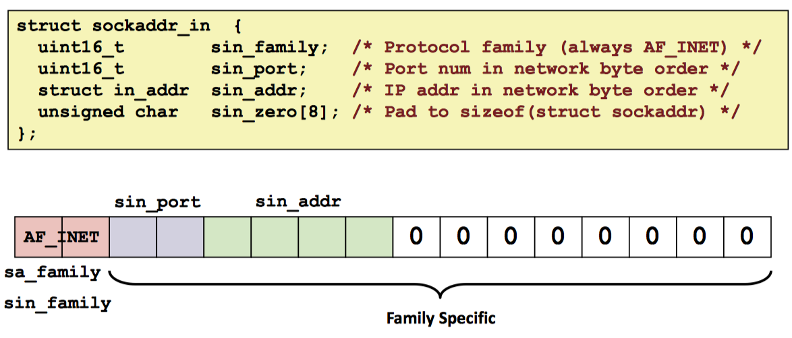   
* Host and Service Conversion: `getaddrinfo`
    * Convert string representations of hostnames, host addresses, ports and service names to socket address structures  
        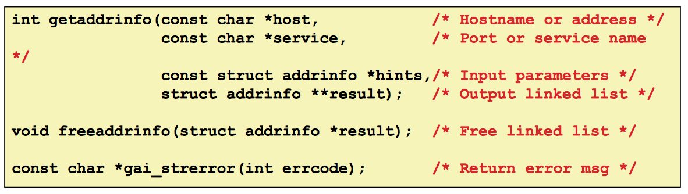   
        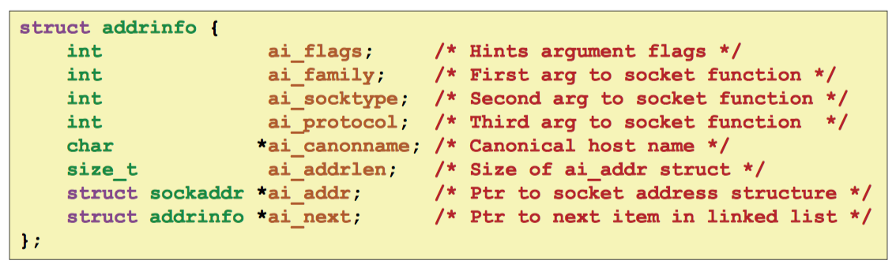   
    * `getnameinfo` is the inverse of `getaddrinfo`
* Client/Server interface  
    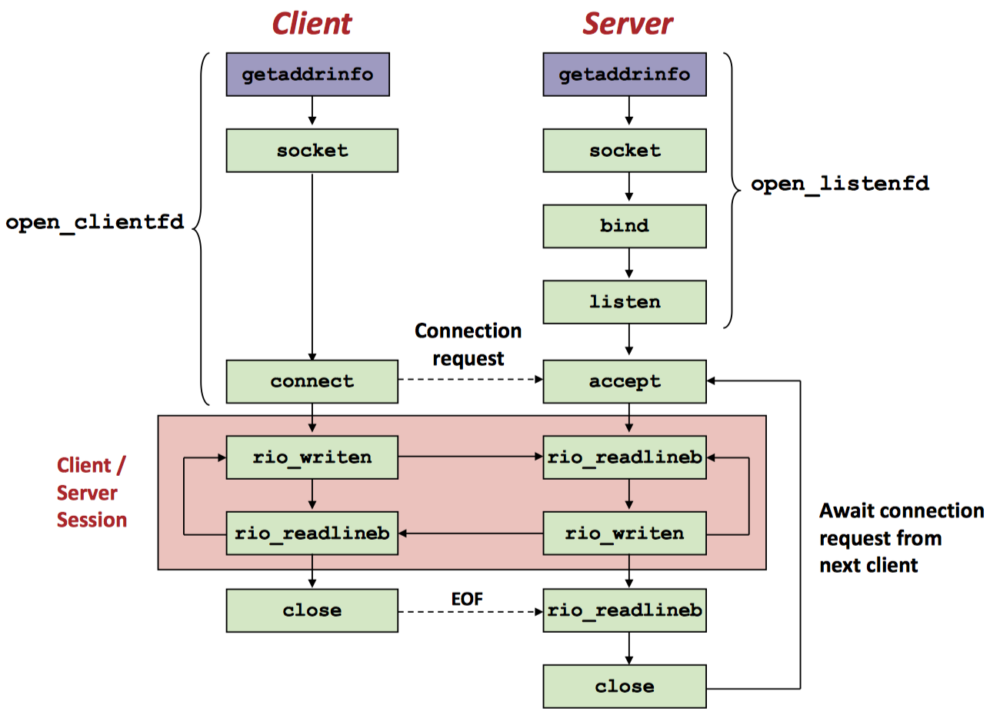   
* `telnet`: Testing servers
    * Creates TCP connection with a server (starts a session)
    * Since the encoding of HTTP is ascii, we can hard-code http requests
* HTTP
    * Content: A sequence of bytes in MIME (Multipurpose Internet Mail Extension) type
    * The contents can be either _static_ or _dynamic_
* Dynamic content: 
    * Produced by server-side program
    * If URI containts `cgi-bin` then serve dynamic content
    * Use `fork()` and `exec()` to execute new program
    * Use env-var `QUERY_STRING` to pass parameters
# Concurrency
* Iterative servers have serious flaws. 
    * Easily get blocked by single misbehaving client
        * Note: Blocking does not happen upon client calling `connect()` or `write()`, but upon `read()`. This is because server's kernel provides buffering
    * So we need concurrent servers
1. Process-based servers
    * Parent __must__ close connected socket (parent doesn't get reaped)
    * Child __should__ close listening socket (child gets reaped)
    * Reap child with `SIGCHLD` handler
2. Event-based servers
    * Manage multiple connections in user space 
    * Determine events using `select()` or `epoll()`
    * Design of choice for high-performance web servers
    * However, hard to provide find-grained concurrency
    * Cannot take advantage of multi-core
3. Thread-based servers
    * Can run threads in `detached` mode. It will run independently, and get reaped automatically
    * Possible race conditions when passing parameters to new thread in `pthread_create()`